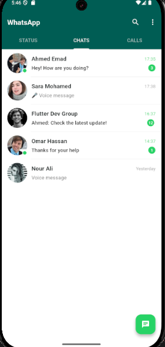
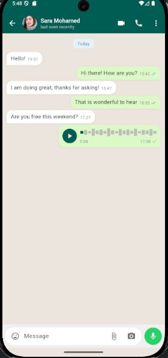
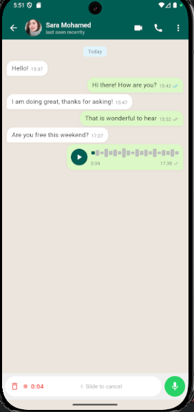
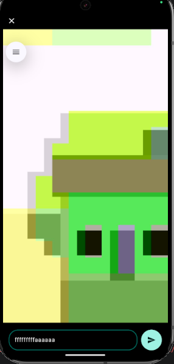
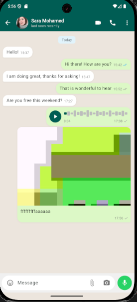
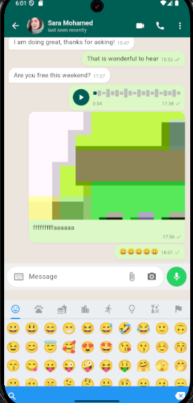
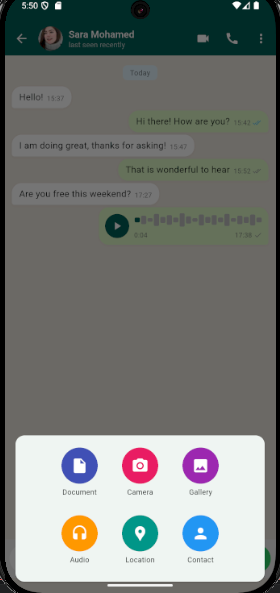
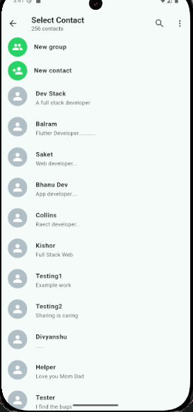

# WhatsApp Clone — Flutter

A feature-rich WhatsApp-inspired messaging UI built with Flutter, following **Clean Architecture** principles and **BLoC** state management.

---

## Screenshots

| Chats List | Chat Screen | Voice Recording |
|:-----------:|:-----------:|:---------------:|
|  |  |  |

| Camera & Preview | Photo in Chat | Emoji Picker |
|:----------------:|:-------------:|:------------:|
|  |  |  |

| Attachment Sheet | Select Contact |
|:----------------:|:--------------:|
|  |  |

---

## Features

- **Text messaging** — multi-line input, send on submit or tap
- **Voice messages** — hold-to-record, animated waveform playback, slide-to-cancel
- **Photo sharing** — camera capture with a preview screen before sending
- **Video recording** — long-press the capture button to record video
- **Gallery picker** — pick photos or videos directly from the device library
- **Document sharing** — pick any file (PDF, Word, Excel, ZIP …) with smart file-type icons
- **Emoji picker** — WhatsApp-style emoji panel with keyboard/emoji toggle
- **Full-screen image viewer** — pinch-to-zoom via `InteractiveViewer`
- **Camera screen** — flash toggle, front/back switch, real-time recording timer badge
- **Message status icons** — sent ✓, delivered ✓✓, read ✓✓ (blue)
- **Unread badge** and last-message preview on the chat list

---

## Architecture

```
lib/
├── core/
│   ├── errors/          # Failure classes
│   ├── services/        # VoiceRecorderController, MediaPickerService
│   ├── usecases/        # Base UseCase<Type, Params> interface
│   └── helper/
│
└── features/
    └── chat/
        ├── data/
        │   ├── datasources/   # ChatLocalDataSourceImpl  (in-memory seed data)
        │   ├── models/        # MessageModel, ChatModel
        │   └── repositories/  # ChatRepositoryImpl
        │
        ├── domain/
        │   ├── entities/      # MessageEntity, ChatEntity
        │   ├── repositories/  # ChatRepository (abstract)
        │   └── usecases/      # SendMessage · SendVoiceMessage · SendImageMessage
        │                      # SendVideoMessage · SendDocumentMessage
        │                      # GetChats · MarkAsRead
        │
        └── presentation/
            ├── cubit/         # ChatCubit, ChatState
            ├── screens/       # ChatScreen, CameraScreen, PhotoPreviewScreen
            └── widgets/       # Input bar, message bubbles, recording area, …
```

**Dependency flow:** `Presentation → Domain ← Data`  
The domain layer has zero Flutter or third-party package dependencies.

---

## Tech Stack

| Category | Package |
|---|---|
| State management | `flutter_bloc` + Cubit |
| Dependency injection | `get_it` |
| Functional error handling | `dartz` (Either / Failure) |
| Voice recording | `record 5.0.0` |
| Audio playback | `audioplayers` |
| Camera | `camera` + `camera_android` |
| Gallery picker | `image_picker` |
| File / document picker | `file_picker` |
| Runtime permissions | `permission_handler` |
| Emoji picker | `emoji_picker_flutter` |
| Equality helpers | `equatable` |
| Date formatting | `intl` |

---

## Getting Started

### Prerequisites

- Flutter SDK **≥ 3.9.2**
- Android: `minSdkVersion 21`, physical device recommended (camera + microphone)
- iOS: Xcode 15+, physical device recommended

### Clone & run

```bash
git clone https://github.com/your-username/whatsapp-flutter.git
cd whatsapp-flutter
flutter pub get
flutter run
```

> **Important:** always use `flutter run` (full cold build) after pulling new changes or adding plugins.  
> `hot reload` / `hot restart` do **not** register native plugin code.

### Required permissions

#### Android — `android/app/src/main/AndroidManifest.xml`

```xml
<uses-permission android:name="android.permission.RECORD_AUDIO"/>
<uses-permission android:name="android.permission.CAMERA"/>
<uses-permission android:name="android.permission.READ_MEDIA_IMAGES"/>
<uses-permission android:name="android.permission.READ_MEDIA_VIDEO"/>
<uses-permission android:name="android.permission.READ_EXTERNAL_STORAGE"
    android:maxSdkVersion="32"/>
```

#### iOS — `ios/Runner/Info.plist`

```xml
<key>NSCameraUsageDescription</key>
<string>Camera access is required to take photos and videos.</string>
<key>NSMicrophoneUsageDescription</key>
<string>Microphone access is required to record voice messages and videos.</string>
<key>NSPhotoLibraryUsageDescription</key>
<string>Photo library access is required to send images and videos.</string>
```

---

## How to Add Screenshots

### Step 1 — Take the screenshots

| Method | How |
|---|---|
| Android emulator | Camera icon in the emulator toolbar, or `Ctrl + S` in Android Studio |
| Physical Android | Power + Volume Down simultaneously |
| Flutter CLI | `flutter screenshot --out=screenshots/name.png` |
| iOS Simulator | `Cmd + S` in the Simulator window |

### Step 2 — Add them to the project

```bash
# create the folder (only once)
mkdir screenshots

# copy your .png files in and name them exactly:
#   screenshots/chats_list.png
#   screenshots/chat_screen.png
#   screenshots/voice_recording.png
#   screenshots/camera.png
#   screenshots/emoji_picker.png
#   screenshots/attachment_sheet.png
```

### Step 3 — Commit and push

```bash
git add screenshots/
git commit -m "docs: add app screenshots"
git push
```

The screenshot table at the top of this file will render automatically on GitHub once the image files exist at those paths.

> **Tip:** if you use different filenames, just update the `` links in the table above to match.

---

## Project Status

| Phase | Scope | Status |
|---|---|---|
| Phase 1 | Core chat UI · text & voice messages · clean architecture | ✅ Complete |
| Phase 2 | Camera · gallery · document sharing · emoji picker | ✅ Complete |

---

## License

This project is for demonstration and client delivery purposes.  
All rights reserved © 2025.
